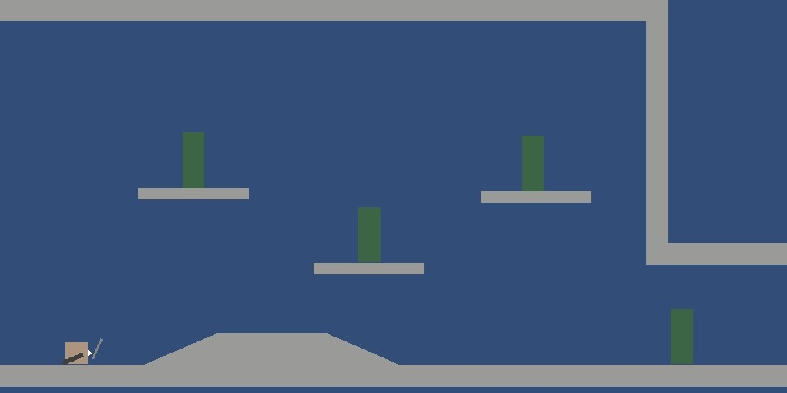

# Sheathe（仮）
※現在プロトタイプを制作中です。

## ゲームコンセプト
刀を鞘に納めた瞬間、一斉に影響を与える爽快感を味わえるゲーム。

## ゲーム概要
プレイヤーである侍が、進行中に敵やオブジェクトを斬っていくアクションパズルゲームです。 
斬った瞬間ではなく、刀を鞘に収めたタイミングで斬った敵に影響が与えられます。 
敵を斬り進めた後、納刀のタイミングを見極めることが攻略の鍵となります。

## スクリーンショット（2025年6月時点）

## 動画デモ（2025年6月時点）
https://github.com/user-attachments/assets/cc124e65-f1fc-438a-9e94-0c0bdc4d2cac

## 操作方法
- 移動　　　：左スティック/左右キー
- 斬撃　　　：Xボタン/Xキー
- ジャンプ　：Aボタン/上キー
- 納刀　　　：Yボタン/Zキー

## プレイ時間の目安
3時間

## 制作の目的
自分のアイデアを形にしたいという思いから、趣味として制作を始めました。 
企画から制作・完成・公開までのプロセスを経験することが大きな目的です。

## 開発体制
個人開発（1人）

## 開発環境
Unity 6000.0.32f1（C#） 
JetBrains Rider

## コーディング規約
- クラス名はPascalCase形式（例：PlayerController）
- Private変数は先頭に"_"を付け、その後はcamelCase形式（例：_playerSpd）
- Public変数・プロパティはPascalCase形式（例：PlayerSpd）
- ローカル変数はcamelCase形式（例：moveSpd）
- メソッド名はPascalCase形式（例：MovePlayer）
- asyncメソッド名にはAsyncサフィックスを付ける（例：LoadDataAsync）

## 今後の想定
- 仮素材を用いたプロトタイプをもってデザイナーの方にご協力を依頼する予定です。
- ゲームイベントへの出展やSteamでの販売を検討しています。

## 参考ゲーム
- [ElecHead](https://store.steampowered.com/app/1456880/ElecHead/?l=japanese)
- [Katana ZERO](https://store.steampowered.com/app/460950/Katana_ZERO/)
