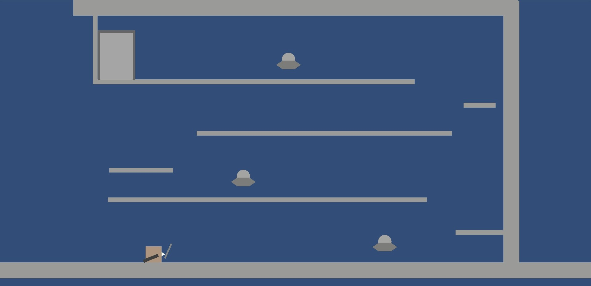

# Sheathe（仮）

## ゲームコンセプト
刀を鞘に納めた瞬間、一斉に影響を与える爽快感を味わえるゲーム。

## ゲーム概要
プレイヤーである侍が、進行中に敵やオブジェクトを斬っていくアクションパズルゲームです。 
斬った瞬間ではなく、刀を鞘に収めたタイミングで斬った敵に影響が与えられます。 
最適な場所で納刀することで、連鎖的に物事が進行します。

## 制作の目的
自分のアイデアを形にしたいという思いから、趣味として制作を始めました。 
また、企画から制作・完成・公開までのプロセスを経験することも目的の一つです。

## 開発体制
個人開発（1人）

## 開発環境
Unity 6000.0.32f1（C#） 
JetBrains Rider

## プレイ時間の目安
2時間

## 操作方法
- 移動　　　：左スティック/左右キー
- 斬撃　　　：Xボタン/Xキー
- ジャンプ　：Aボタン/上キー
- 納刀　　　：Yボタン/Zキー

## 今後の想定
- 自分では絵を描けないため、仮素材を用いたプロトタイプをもってデザイナーの方にご協力をお願いする予定です。
- 完成の目途が立てば、イベントへの出展やsteamでの販売も検討しています。

## スクリーンショット（2025年6月時点）

## 動画デモ（2025年6月時点）
https://github.com/user-attachments/assets/60efac03-28bb-4523-80ec-79dca2361a78

